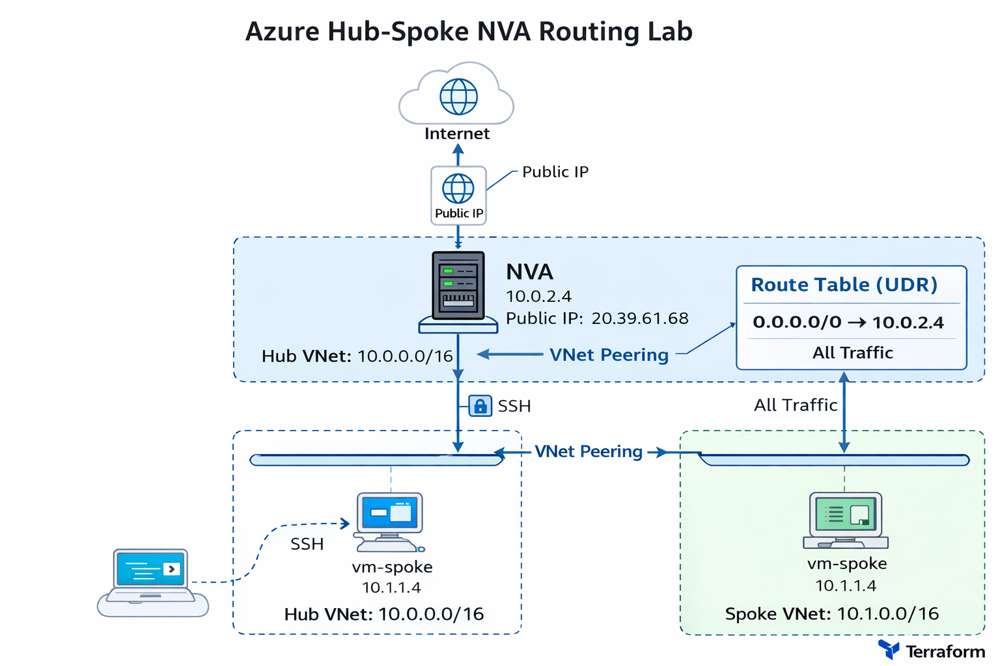

# Azure Hub-Spoke NVA Routing Lab

## Overview
This project demonstrates a Hub-Spoke network architecture in Azure using Terraform.  
All outbound traffic from the spoke network is routed through a Linux-based Network Virtual Appliance (NVA) in the hub.

## Architecture Diagram



## Key Components

### Hub VNet
- Address space: `10.0.0.0/16`
- NVA subnet: `10.0.2.0/24`
- NVA private IP: `10.0.2.4`

### Spoke VNet
- Address space: `10.1.0.0/16`
- Workload subnet: `10.1.1.0/24`
- Spoke VM private IP: `10.1.1.4`

### Routing
- User Defined Route on spoke subnet:
  - `0.0.0.0/0 -> 10.0.2.4`
- All outbound traffic from the spoke is forced through the NVA

### NVA Configuration
- Ubuntu Linux VM in the hub
- Azure NIC IP forwarding enabled
- Linux IP forwarding enabled
- NAT configured with `iptables`

### Access Model
- NVA has a public IP for administration
- Spoke VM is private-only
- SSH path:
  - Laptop -> NVA -> Spoke VM

## Validation Performed

### Internet Connectivity Test
From `vm-spoke`:

```bash
ping -c 4 8.8.8.8
curl -4 http://ifconfig.me/ip